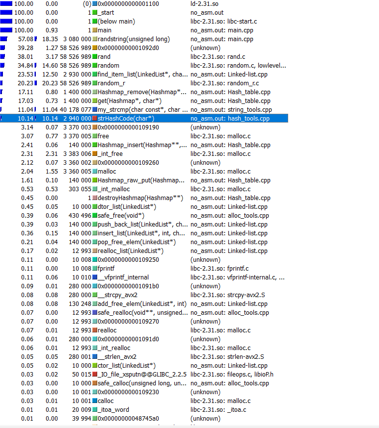
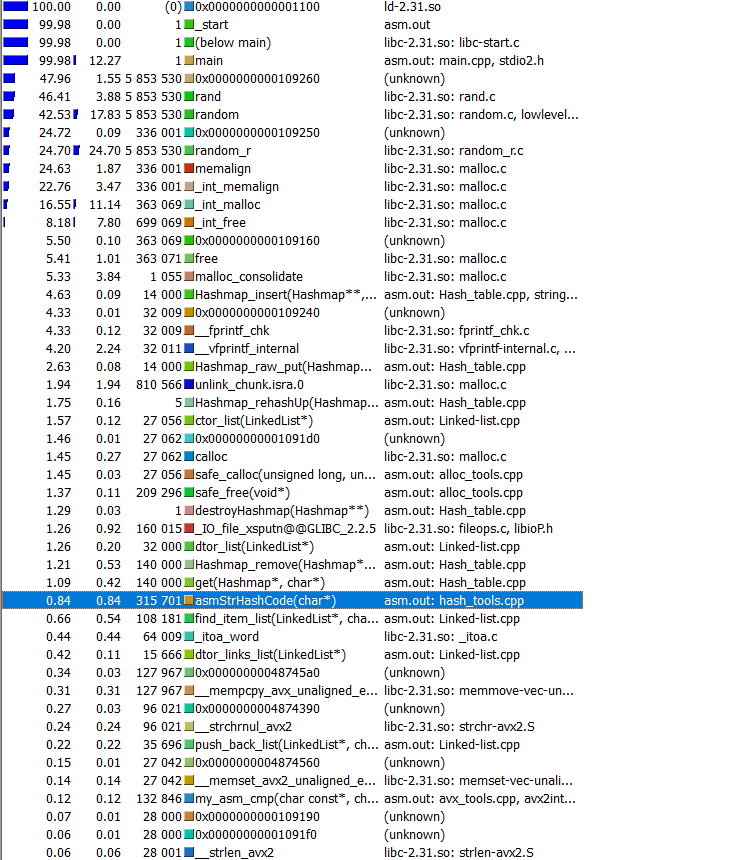

# Here is the optimisation that I applied with help of callgrind and complied Kcachegrind

note:
  * average count of elements in every bucket is 14 (forced table to have fixed size = 1.4 * 1e5)
  * Functions (get\remove) were tested on 1.4 * 1e6 amount of elements

## Here is comparison:

* ### No hash optimisation:
  ```
  __attribute__((noinline)) uint64_t strHashCode(char* str) {
    uint64_t hash = 123456;
    while (*str) {
        hash = ((hash << 7) + hash) ^ *(str++);
    }

    return hash;
  }
  ```
  results:
  
  
  
* ### Hash optimisation with __asm__:
  ```
  __attribute__((noinline)) uint64_t asmStrHashCode(char* str) {
    uint64_t hash = 123456;
    __asm__ ( ".intel_syntax noprefix\n\t"
        "mov rsi, %1\n\t"
        "mov rbx, 1234\n\t" /* ассемблерная вставка */
        "mov rcx, 0\n\t" /* ассемблерная вставка */
        "mov rax, 0\n\t"
        "begin:\n\t" /* ассемблерная вставка */
        "lodsb \n\t"
        "test al, al\n\t"
        "je end\n\t"
        "mov rcx, rbx\n\t"
        "shl rbx, 7\n\t"
        // "xor rbx, rax\n\t"
        "add rbx, rcx\n\t"
        "xor rbx, rax\n\t"
        "jmp begin\n\t"
        "end:\n\t"
        "mov %0, rbx\n\t"
        ".att_syntax\n\t"
        : "=r"(hash) /* выходные операнды */
        : "r"(str) /* входные операнды */
        : "%rsi", "%rax", "%rcx", "%rbx" /* разрушаемые регистры */
        );
    return hash;
  }
  ```
  results:
  


In cocnlusion, hash function has been optimized twice, but there are some more optimisations: hashes of key can be stored in Entry structure, so when strings aren't equal, we can determine it faster
