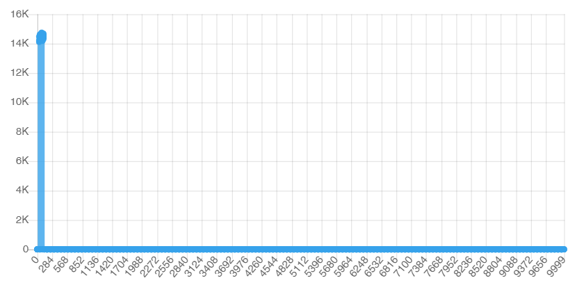

# Comparison of different hash functions

note: 
  * Amount of elements in bucket is listed on y axis, on x axis - index of bucket.
  * Functions were tested on 1.4 * 1e6 amount of elements and expansion coef = 2
  * Hashmap buckets count was forced to be constant = 1e5

## Here is comparison:

* ### Ascii hash code:
  Use first symbol as hash code
  ```
  uint64_t asciiHashCode(char* str) {
    // uint64_t hash = 1234;
    // printf("%d\n", str[0]);
    return str[0]; 
  }
  ```
  results:
  

