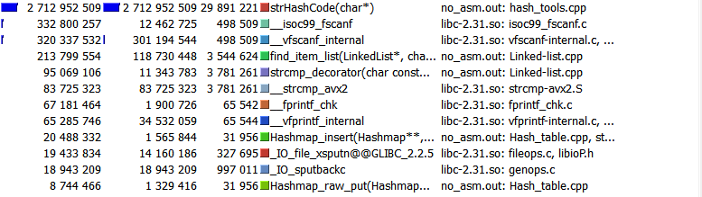
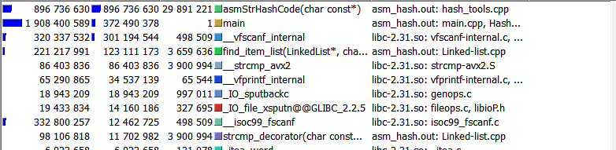
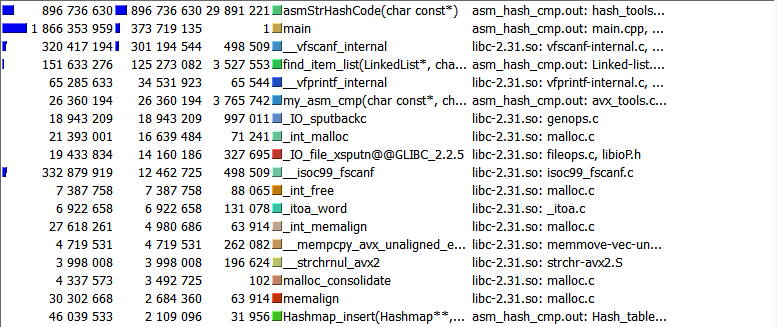
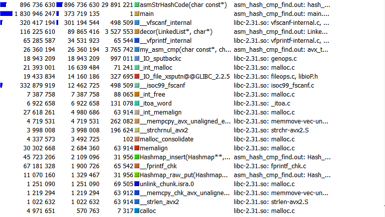

# Here is the optimisztion that I applied with help of callgrind and complied Kcachegrind

note:
  * average count of elements in every bucket is 14 (forced table to have fixed size = 1.4 * 1e5)
  * Functions (get/remove) were tested on 1.4 * 1e6 amount of elements

# Here is comparison:

* ## No hash optimization:
  (gnu hash)
  ```
  __attribute__((noinline)) uint64_t strHashCode(char* str) {
    uint64_t hash = 123456;
    while (*str) {
        hash = ((hash << 7) + hash) ^ *(str++);
    }

    return hash;
  }
  ```
  time: 28.7 seconds

  results:

  
  

* ## Hash optimization with __asm__ (crc32):
  (gnu hash was changed to crc32 with hardware acceleration)
  ```
  __attribute__((noinline)) uint64_t asmStrHashCode(char* str) {
     size_t hash = 0;
    __asm__ (".intel_syntax noprefix\n\t"
        "mov rcx, 4\n\t"
        "0:\n\t"
        "mov rax, [%[arg_val]]\n\t"
        "crc32 %[ret_val], rax\n\t"
        "add %[arg_val], 8\n\t"
        "loop 0b\n\t"
        "1:\n\t"
        ".att_syntax prefix\n\t"
        : [ret_val]"=S"(hash)
        : [arg_val]"D"(str)
        :"%rax", "%rcx", "cc"
    );
    return hash;
  }
  ```

  time: 12.3 seconds (2.3x times faster than previous/base)

  results: 

  

* ## Cmp optimization:
  ```
  int my_asm_cmp(const char* first, const char* second) {
    __m256i mfst = _mm256_load_si256((__m256i*) first);
    __m256i mscd = _mm256_load_si256((__m256i*) second);
    
    return  1 + _mm256_movemask_epi8(_mm256_cmpeq_epi8(mfst, mscd));
  }
  ```
  time: 11.0 seconds (2.61x times faster than base, 1.12x times faster than previous)

  results:

  


* ## Find in list optimization:
  ```
  extern "C" int64_t find_list(LinkedList* list, HKey val);
  __attribute__((noinline)) int64_t decor(LinkedList* list, HKey val) {
    return find_list(list, val);
  }

  assembler code:
  find_list:
                mov rdx, rdi ; replase list* to rdx
                mov r9, [rdx + 48] ;list->data
                mov r9, [r9 + 24] ; r9 now is cur_ind
                mov rcx, [rdx]  ; now rcx - size
                mov rax, rcx
                mov rdx, [rdx + 48] ;now rdx  is list->data
                ; r9 - cur_ind
                ; rdx - list->data
                ; rcx - size

        .find_loop:
                test rcx, rcx
                jz .doesnt_exist

                mov rdi, r9
                imul rdi, 40
                mov rdi, [rdx + rdi + 8]
                call _Z10my_asm_cmpPKcS0_
                
                test rax, rax
                jz .exists
                
                mov rdi, r9
                imul rdi, 40
                mov r9, [rdx + rdi + 24]
                dec rcx
                jmp .find_loop
            
        .doesnt_exist:
                mov rax, 0
                ret

        .exists:
                mov rax, r9
                ret
    
    ret
  ```
  time: 10.1 seconds (2.81x times faster than base, 1.05 times faster than previous)

  results:

  


* ## After inlining:
  time: 10.2 seconds (previous time: 10.1, delta 0.1 sec) 

  It is thought to be a measurement error. Programs were compiled with -O3 compilation key, so they could have been inlined already. Due to small speed changes detailed profiler data do not needed


In conclusion, further optimizations are not required, as they will only harm portability and speed up the program extremely poorly.
